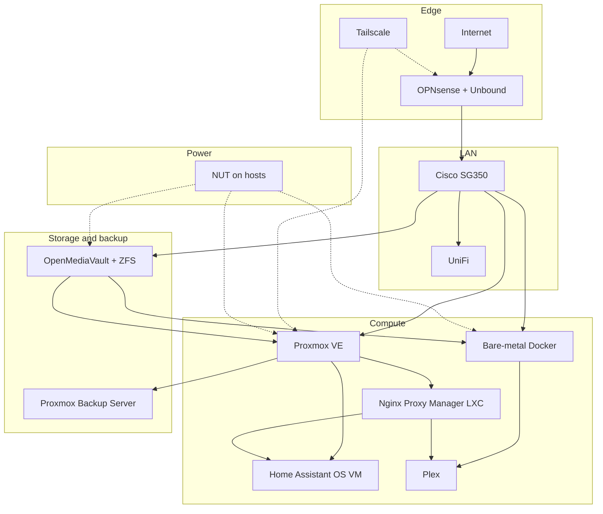

# Homelab architecture (sanitized)

Logical layout only. No private addresses, hostnames, serials, or real configs.

**Data flow (high level)**

1. Internet traffic enters through OPNsense; Unbound handles local DNS.
2. The switch and UniFi carry segmented LAN traffic to compute and storage.
3. Proxmox VE runs Home Assistant OS as a virtual machine and Nginx Proxy Manager as an LXC.
4. Plex runs on the bare-metal Docker host.
5. OpenMediaVault on ZFS provides shared storage and media mounts.
6. Proxmox Backup Server receives backup jobs from the hypervisor stack.
7. Nginx Proxy Manager fronts selected services; Tailscale provides controlled remote access.
8. NUT monitors UPS power on the hosts — not as a Docker container.

Edges are product roles, not a wiring diagram of a specific rack.
