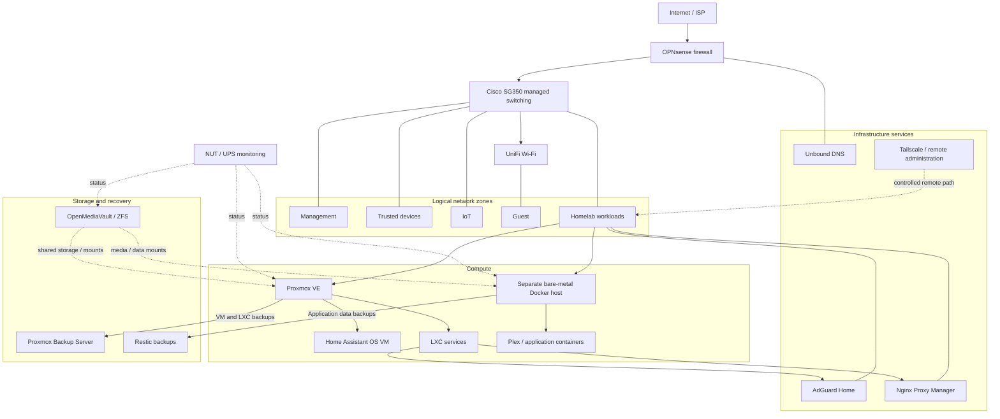

# Homelab logical architecture

Sanitized product/role diagram. The zones below show **segmentation intent**, not actual VLAN IDs, switch ports, hostnames, addressing, or firewall rule order.

## Reading the diagram

- The firewall governs crossing between network zones; lines to zones do not grant unrestricted access.
- Unbound and AdGuard Home are both in the DNS stack. This diagram deliberately does not assert a specific resolver-chain order.
- Proxmox Backup Server and Restic represent **different** backup scopes; the diagram makes no claim that PBS protects bare-metal Docker data.
- Reverse proxying selected web services and remote administration over Tailscale solve different access problems.
- NUT is represented as host-level power monitoring, not an application container.

This is a conceptual map only; exact dependencies, retention settings and restore commands are maintained privately.
