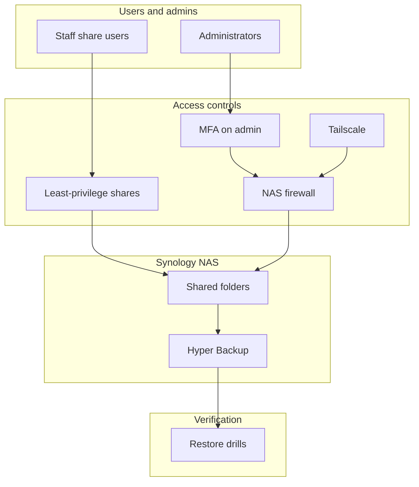

# Synology NAS solution architecture (sanitized)

Logical layout only. No private addresses, hostnames, serials, client names, or real configs. Organization described only as a live entertainment company.

**Solution flow (high level)**

1. Staff reach only the shares their roles require (least privilege).
2. Administrative access requires MFA and is constrained by the NAS firewall.
3. Tailscale provides controlled remote access without broadly exposing the management UI.
4. Shared folders hold day-to-day data.
5. Hyper Backup captures that data with documented retention.
6. Restore drills confirm backups are usable, not only that jobs completed.

This is a control and data-path sketch, not a site-specific network map.
