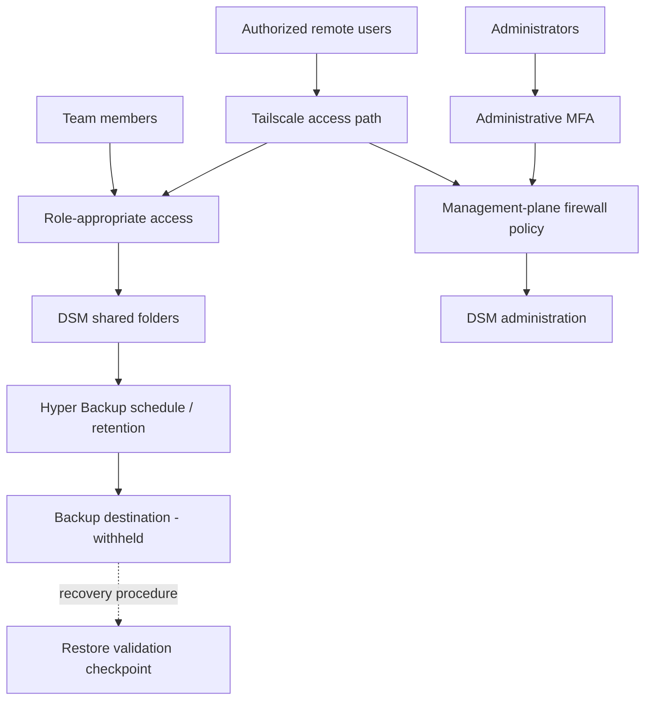

# Synology NAS solution architecture (sanitized)

Conceptual access-and-recovery model, not a depiction of an identifiable deployment.

## Control boundaries

- Staff share access and DSM administrative access are separate functions.
- Tailscale is an access transport; it does not replace DSM permissions, MFA or firewall policy.
- Hyper Backup configuration documents the backup process. The restore-validation checkpoint is a **required verification step**, not a claim that a drill has already passed.
- Arrows describe responsibility and data/control flow, not actual ACLs, routes, public endpoints or site topology.

No client or production identifiers appear here.
